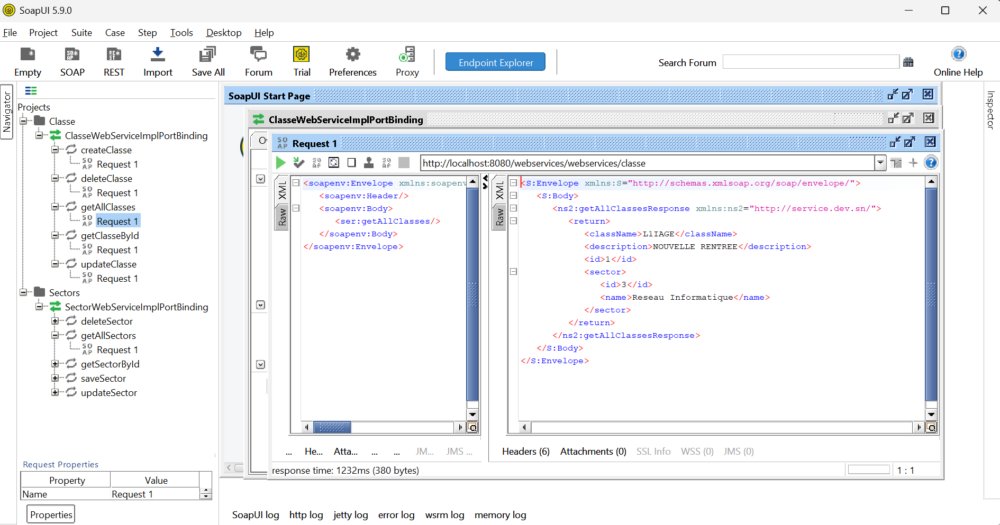

# soapMaven
Ce projet Java modulaire met en place un système de gestion de secteurs et de classes via des services web SOAP.

Il est structuré en deux modules :

metier : contient la logique métier, les entités, les DTOs, les DAOs, les mappers et les services métiers.

webservices : expose les fonctions métier sous forme de services web SOAP, permettant l'intégration avec d'autres applications.

# Environnement:
- JDK 17
- Maven 3.8.6
- IntelliJ IDEA 2023.2.3
- MySQL 8.0
- SOAP UI pour tester les services web

# Installation et exécution
1- Cloner le dépôt :
```bash
git clone https://github.com/votre-utilisateur/projet-soap.git
```
2- Ouvrir le projet dans IntelliJ IDEA.
3- Dans le terminal, naviguer jusqu'au répertoire docker.
4- Lancer les conteneurs Docker :
```bash
docker-compose up -d
```
5- Attendre que les conteneurs soient opérationnels (MySQL et Tomcat).
   - Nettoyez le projet Maven en tape `mvn clean install`.
6- Deployer sur Tomcat :
   - Configurer Tomcat dans IntelliJ (si ce n'est pas déjà fait).
   - Déployer le module webservices sur Tomcat.

7- Accéder à l'interface SOAP :
    - Ouvrir SOAP UI.
    - Cliquer sur "File" > "New SOAP Project".
    - Donner un nom au projet par exemple "soapMaven".
    - Entrer l'URL du WSDL : `http://localhost:8080/webservices/webservices/classe?wsdl`.
    - Cliquer sur "OK".

8- Tester les services :
    - Dans SOAP UI, vous verrez les opérations disponibles.
    - Sélectionner une opération, par exemple `getAllClasses`.
    - Cliquer sur "Request 1" pour voir la requête générée.
    
    - Cliquer sur "Submit Request" pour envoyer la requête.
    - Vous devriez voir la réponse dans le panneau de réponse.

# Structure du projet
```
    📦 mon-projet-soap/
├── 📁 docker/
│   ├── compose.yml             # Fichier de configuration Docker Compose
├── 📁 metier/                         # Module métier (logique applicative)
│   ├── 📁 src/
│   │   ├── 📁 main/
│   │   │   ├── 📁 java/
│   │   │   │   └── sn/dev/
│   │   │   │       ├── 📁 config/
│   │   │   │       ├── 📁 dao/          # Interfaces DAO
│   │   │   │       ├── 📁 dto/          
│   │   │   │       ├── 📁 entity/        # Entités JPA
│   │   │   │       ├── 📁 mapper/        # Mappers pour convertir entre entités et DTOs
│   │   │   │       ├── 📁 service/       # Services métier
│   │   │   │       └── 📁 exception/      # Exceptions personnalisées                  
│   │   │   │       
│   │   │   │       
│   │   │   │       
│   │   │   │   
│   │   └── 📁 resources/
│   │       └── database.properties # Configuration de la base de données
│   └── pom.xml                       # Dépendances du module metier

├── 📁 webservices/                    # Module exposant les services SOAP
│   ├── 📁 src/
│   │   ├── 📁 main/
│   │   │   ├── 📁 java/
│   │   │   │   └── sn/dev/service/   # Implémentations des Web Services SOAP
│   │   └── 📁 webapp/
│   │       └── WEB-INF/
│   │           └── sun-jaxws.xml     # Configuration des endpoints SOAP
                |   web.xml           # Configuration du webapp
│   └── pom.xml                       # Dépendances du module webservices

├── pom.xml                           # Fichier parent (packaging = pom)

└── README.md                         # Documentation du projet


Modules Maven :
- metier : module principal contenant la logique métier, les entités, les DTOs, les DAOs, les mappers et les services métiers.
- webservices : module exposant les services SOAP, permettant l'intégration avec d'autres applications.

Fin de la structure du projet
```
